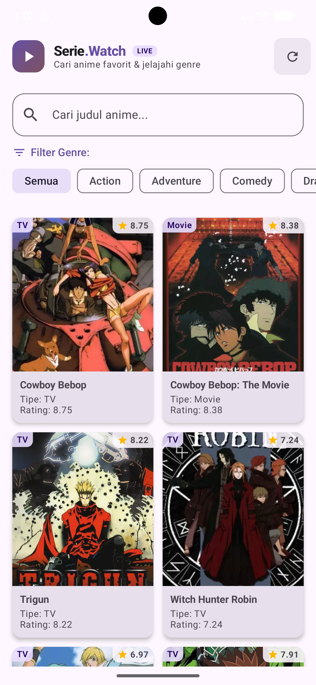
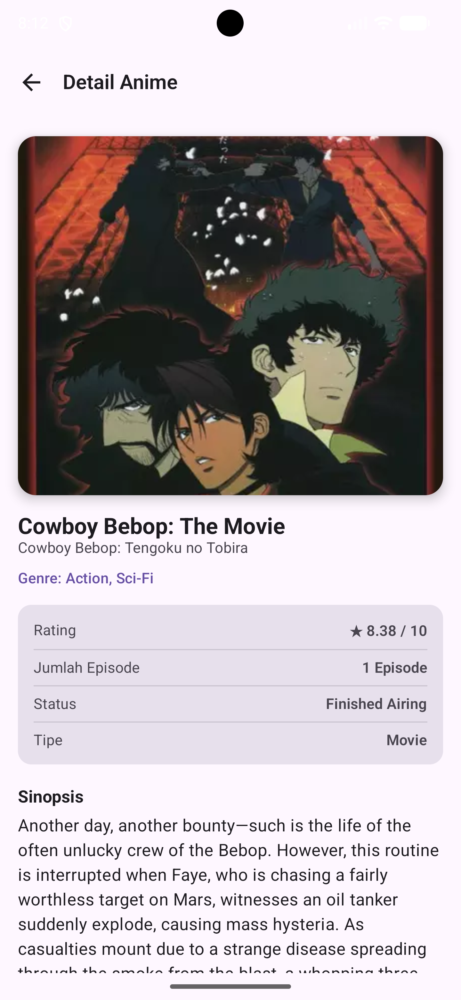

# Pipit Pengen Nonton Anime 🎬

Aplikasi pencarian dan katalog anime berbasis Android yang dikembangkan untuk memenuhi tugas Responsi Pemrograman Mobile (Pemmob). Aplikasi ini memanfaatkan REST API dari **Tenrai API v1** untuk menyajikan informasi anime secara dinamis, modern, dan responsif.

---

## 📱 Ringkasan Fitur & Spesifikasi

- **Bahasa Pemrograman**: 100% Kotlin (memanfaatkan Data Class, Null Safety, Lambda, Collection, Coroutines & Flow).
- **User Interface**: Jetpack Compose dengan Material Design 3 (M3).
- **Desain & Tema**: Custom Theme (Dark Mode & Light Mode support) dan Custom Typography.
- **Tampilan Data**: Menggunakan `LazyVerticalGrid` untuk daftar anime yang dinamis dan terstruktur.
- **Pencarian & Filter**: 
  - Pencarian anime interaktif berdasarkan judul dengan auto-debounce.
  - Filter kategori genre (Action, Adventure, Comedy, Drama, Fantasy, Romance, Sci-Fi, dll.).
- **Navigasi**: Navigation Compose dengan 2 layar utama:
  1. **Home Screen**: Menampilkan judul aplikasi, kolom pencarian (search bar), filter chip genre, dan grid katalog anime.
  2. **Detail Screen**: Menampilkan informasi lengkap anime (poster hero, judul, daftar genre, rating, jumlah episode, status penayangan, dan sinopsis lengkap).
- **State Management & Arsitektur**: Arsitektur **MVVM (Model - View - ViewModel - Repository)** dengan penanganan state reaktif (`UiState`: *Loading*, *Success*, *Error*, *Idle*).
- **Custom Launcher Icon**: Ikon aplikasi kustom bertema anime (emblem pelindung dahi ninja & bintang anime).

---

## 📸 Screenshot & GIF Aplikasi


| Home Screen (Pencarian & Filter) | Detail Screen (Informasi Lengkap) |
| :---: | :---: |
|  |  |

---

## 🏛️ Penjelasan Arsitektur MVVM

Aplikasi ini menerapkan arsitektur **Model-View-ViewModel (MVVM)** dengan pemisahan tanggung jawab (*separation of concerns*) yang jelas:

```text
               ┌────────────────────────────────────────────────────────┐
               │                         VIEW                           │
               │  - HomeScreen.kt (Grid, Search Bar, Genre Filter)     │
               │  - DetailScreen.kt (Detail Info & Sinopsis)           │
               └───────────────────────────▲────────────────────────────┘
                                           │ StateFlow & Events
                                           ▼
               ┌────────────────────────────────────────────────────────┐
               │                      VIEWMODEL                         │
               │  - AnimeViewModel.kt                                   │
               │    * Mengelola _animeListState, _detailState           │
               │    * Mengelola _searchQuery & _selectedGenreId         │
               │    * Menjalankan Coroutines (viewModelScope)           │
               └───────────────────────────▲────────────────────────────┘
                                           │ Coroutine Suspend Calls
                                           ▼
               ┌────────────────────────────────────────────────────────┐
               │                      REPOSITORY                        │
               │  - AnimeRepository.kt                                  │
               │    * Abstraksi sumber data (Single Source of Truth)    │
               │    * Menjembatani ViewModel dan ApiClient              │
               └───────────────────────────▲────────────────────────────┘
                                           │
                                           ▼
               ┌────────────────────────────────────────────────────────┐
               │                     DATA & NETWORK                     │
               │  - JikanApiService.kt (Retrofit Interface)             │
               │  - ApiClient.kt (Retrofit Client)                      │
               │  - AnimeModels.kt (Data Classes / DTOs)                │
               └────────────────────────────────────────────────────────┘
```

1. **View (Composable UI)**
   - Bertanggung jawab murni untuk merender tampilan berdasarkan state (*state-driven UI*).
   - Mengamati (*collect*) `StateFlow` dari ViewModel menggunakan `collectAsState()`.
   - Tidak pernah melakukan pemanggilan API langsung.

2. **ViewModel (`AnimeViewModel`)**
   - Bertanggung jawab memproses logika presentasi dan memelihara state UI sepanjang siklus hidup Composable.
   - Menggunakan `MutableStateFlow` yang diekspos sebagai immutable `StateFlow` (`searchQuery`, `selectedGenreId`, `animeListState`, `detailState`).
   - Menerapkan *debounce* pada input query pencarian untuk mencegah *rate-limiting* pada API.

3. **Repository (`AnimeRepository`)**
   - Bertindak sebagai lapisan perantara (*mediator*) antara ViewModel dan Remote Network API.
   - Menyediakan fungsi bersih seperti `searchAnime(query, genreId)` dan `getAnimeDetail(malId)`.

4. **Model (Data Classes)**
   - Memodelkan struktur data respons JSON dari REST API menggunakan Gson serialization annotations (`@SerializedName`).

---

## 🌐 Penjelasan Penggunaan API

Aplikasi menggunakan **Tenrai API v1** (layanan REST API berbasis Cloudflare untuk katalog anime dengan schema MyAnimeList/Jikan).

### 1. Base URL
```
https://api.tenrai.org/v1/
```

### 2. Endpoint Pencarian & Katalog Anime
- **HTTP Method**: `GET`
- **Path**: `/anime`
- **Query Parameters**:
  - `q` : Kata kunci judul anime yang dicari (opsional). Contoh: `q=naruto`.
  - `genres` : ID genre anime untuk pemfilteran (opsional). Contoh: `genres=1` (Action).
  - `order_by` : Diurutkan berdasarkan `popularity`.
  - `sort` : Urutan `asc`.
- **Contoh Request**:
  ```
  GET https://api.jikan.moe/v4/anime?q=naruto
  GET https://api.jikan.moe/v4/anime?genres=22
  ```

### 3. Endpoint Detail Anime
- **HTTP Method**: `GET`
- **Path**: `/anime/{id}`
- **Path Parameter**:
  - `id` : Nilai `mal_id` dari anime yang dipilih.
- **Contoh Request**:
  ```
  GET https://api.jikan.moe/v4/anime/20
  ```

### 4. Penanganan State Jaringan
- **Loading State**: Menampilkan indikator putar (`CircularProgressIndicator`) saat data sedang diunduh.
- **Success State**: Memperbarui tampilan daftar atau detail anime secara otomatis melalui mekanisme rekomposisi Jetpack Compose.
- **Error State**: Menangkap kegagalan jaringan atau timeout dan menampilkan tombol **"Coba Lagi"** (*Retry*).

---

## 🚀 Cara Menjalankan Proyek

1. Clone repositori ini:
   ```bash
   git clone <URL_REPOSITORY_ANDA>
   ```
2. Buka folder proyek di **Android Studio** (Koala / Ladybug / Jellyfish atau versi yang lebih baru).
3. Tunggu proses **Gradle Sync** hingga selesai.
4. Pastikan koneksi internet aktif karena aplikasi memerlukan akses ke Jikan API.
5. Jalankan aplikasi pada Emulator Android (API Level 33+) atau perangkat fisik melalui tombol **Run 'app'** (`Shift + F10`).

---

## 📹 Petunjuk Video Penjelasan Kode (Submission)

Sesuai ketentuan pengumpulan tugas:
1. **Durasi Demonstrasi (1 - 2 Menit)**:
   - Tunjukkan aplikasi berjalan di emulator atau smartphone fisik.
   - Demokan fitur pencarian judul anime.
   - Demokan pemilihan filter genre dan amati pembaruan daftar secara otomatis.
   - Klik salah satu anime untuk melihat transisi ke halaman Detail Screen (poster, judul, genre, rating, episode, status, sinopsis).
   - Tunjukkan tombol navigasi kembali ke halaman utama.
2. **Durasi Penjelasan Kode (8+ Menit)**:
   - Jelaskan konfigurasi `build.gradle.kts` (Compose, Retrofit, Coil, Navigation).
   - Jelaskan model data pada `AnimeModels.kt`.
   - Jelaskan antarmuka Retrofit pada `JikanApiService.kt` dan konfigurasi `ApiClient.kt`.
   - Jelaskan cara kerja `AnimeRepository.kt`.
   - Jelaskan manajemen state dan coroutines pada `AnimeViewModel.kt`.
   - Jelaskan konsep Composable dan Recomposition pada `HomeScreen.kt` dan `DetailScreen.kt`.
   - Jelaskan konfigurasi rute navigasi pada `AppNavigation.kt`.
   - Tunjukkan konfigurasi `AndroidManifest.xml` (Internet Permission & Launcher Activity) dan kustomisasi launcher icon.
3. **Pengumpulan**:
   - Form pengumpulan: [https://forms.gle/QRFeEX5NC5WVxoaZA](https://forms.gle/QRFeEX5NC5WVxoaZA)
